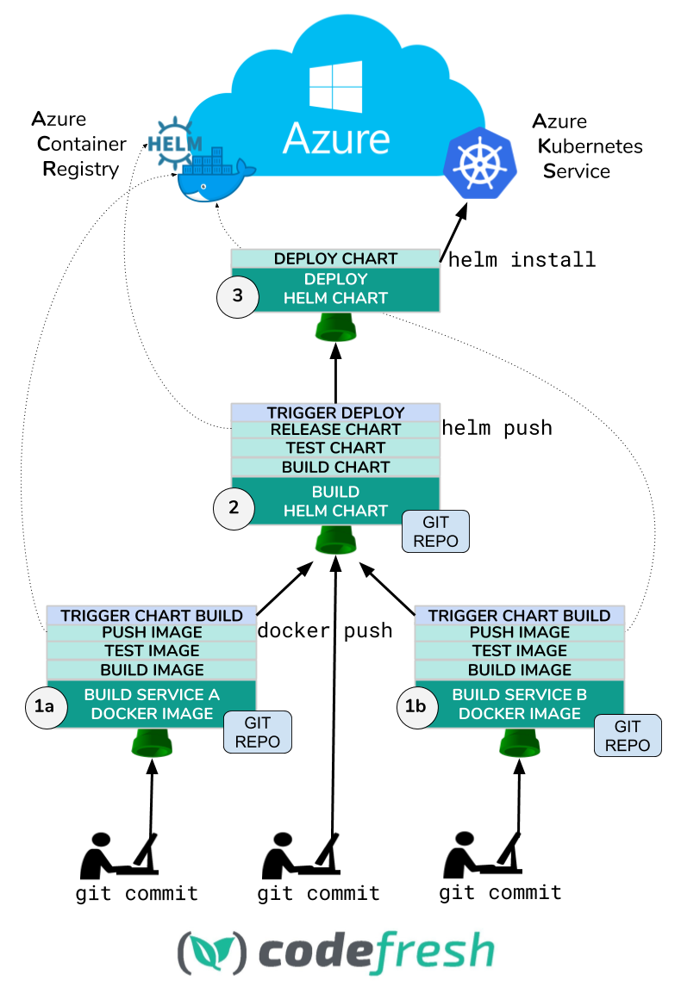

# azure-helm-webinar

**rainbow-kitten-surprise** is a very important application
that provides a unique sensory experience.

It is comprised of a simple frontend,
the [cat-service](services/cat-service),
and the [color-service](services/color-service).

To install (on Azure):

```
cd helm-charts/rainbow-kitten-surprise/

# Use your own AKS Cluster DNS Zone
export CLUSTER_DNS_ZONE="52fc7454c071a75fc1d3.eastus.aksapp.io"
export RELEASE_NAME="azdemo"

helm upgrade --install $RELEASE_NAME \
    --set clusterDnsZone=$CLUSTER_DNS_ZONE \
    .
    
echo "APP URL: http://$RELEASE_NAME.$CLUSTER_DNS_ZONE"
```

To uninstall:

```
helm uninstall $RELEASE_NAME --purge
```

## Pipeline Diagram

All pipeline definitions can be found in the [.codefresh/](.codefresh/) folder.


